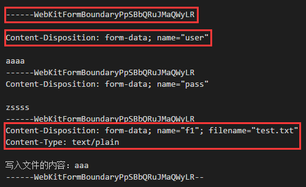

# nodejs_server

原生 nodejs 搭建后台服务

## 实现

1.  接口

2.  数据处理（GET/POST/FILE）

3.  身份验证（cookie/session）

## 原生 Nodejs

1.  数据交互: GET/POST/文件

    - writeHeader 和 setHeader 的区别

      - setHeader：设置 response 头，可以设置多次

      - writeHeader：设置并发送 response 头（最后一次）

    - form 表单三种提交数据方式

      1.  GET

      2.  POST——urlencoded

      3.  POST——form-data

    - 接收文件的 buffer 数据

      

      - 数据解读

        - 换行：\r\n

        - 分隔符：------WebKitFormBoundaryPpSBbQRuJMaQWyLR

        - 两项之间用：`;+空格` 隔开

        - 上图数据的格式为：

        ```
          分隔符\r\n
          说明1\r\n
          \r\n
          数据1\r\n
          分隔符\r\n
          说明2\r\n
          \r\n
          数据2\r\n
          分隔符\r\n
          说明3\r\n
          说明4\r\n
          \r\n
          数据3\r\n
          分隔符--
        ```

        - 最终数据状态

        ```
        <分隔符>\r\n说明\r\n\r\n数据\r\n<分隔符>\r\n说明\r\n\r\n数据\r\n<分隔符>\r\n说明\r\n说明\r\n\r\n数据\r\n<分隔符>--
        ```

        - 第一步，使用分隔符切数据，得到：

        `[<>,<\r\n说明\r\n\r\n数据\r\n>,<\r\n说明\r\n\r\n数据\r\n>,<\r\n说明\r\n说明\r\n\r\n数据\r\n>,<-->]`

        - 第二步，去除头尾

          - arr.shift()

          - arr.pop()

        - 第三步，每一项数据处理

        `<\r\n说明\r\n\r\n数据\r\n>`<br>
        `<\r\n说明\r\n说明\r\n\r\n数据\r\n>`

        3-1 去除头尾的 `\r\n`

        说明\r\n\r\n 数据<br>
        说明\r\n 说明\r\n\r\n 数据

        3-2 找到第一个 `\r\n\r\n` , 将数据分割成两半

        说明,数据<br>
        说明\r\n 说明,数据

        3-3 说明可以转字符串，toString()

2.  文件 -> 数据交互实现

3.  压缩 zlib

    - 本质：流操作

4.  流 stream ： 读一块，发一块

    任何连续的数据都叫流，文件流、网络流、音频流...

    - 读取流：req、fs.createReadStream

    - 写入流：res、fs.createWriteStream

    - 读写流 -> 压缩流、加密。zlib.createGzip()

    - 好处：减少内存的占用，增强系统性能（利用率高）

    - 使用：

      1.  压缩文件

      2.  压缩网络数据 - Content-Encoding

5.  管道操作 pipe：入口 -> 出口

6.  接口管理（Router）路由 -> 需要自己实现，因为原生没有

    - `EventEmitter` 事件队列

    - node 模块单例：不管引用多少次，只要是同一模块，就是相等的，和 new 构造函数不同
